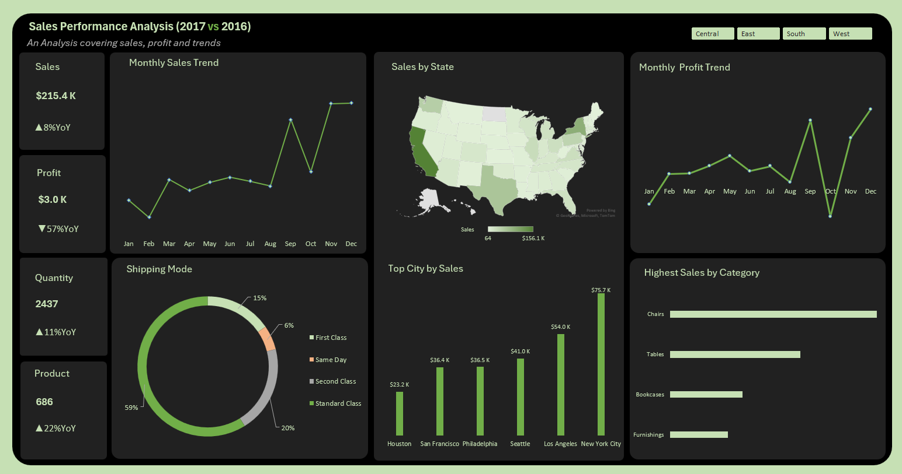

# Excel-Sales_Performance_Analysis
A detailed Excel dashboard analyzing sales performance (2017 vs 2016), uncovering why profit dropped by 57% despite an 8% sales growth. Includes visual insights, pivot tables, and strategic recommendations for business improvement.
# 📉 Sales Performance Analysis Dashboard (2017 vs 2016)

## 📌 Overview

While analyzing this sales dataset, I kept saying *“Wow!”* over and over again. One would expect that an increase in sales means a boom in profit, right? But this dashboard told a different story entirely. Despite an **8% YoY increase in sales**, the **profit plummeted by a staggering 57%**. That’s not just surprising — it’s alarming.

So, I dug deeper, and this dashboard is the story of what I found.

---

## 📊 Objective

This analysis was aimed at comparing the performance of sales, profit, and trends between **2017 and 2016**, identifying gaps, and helping stakeholders rethink and restrategize for the future.

---

## 🧠 Key Insights

### 🔺 Sales are Up, But...
- **Sales increased by $15.8K** (an 8% YoY growth), reaching **$215.4K** in 2017.
- Quantity sold and the number of products also went up by **11%** and **22%** respectively.
- The company expanded in volume and reach, but...

### 🔻 Profits are Down!
- **Profit dropped to $3.0K**, down **57%** from the previous year.
- This contradiction between rising sales and falling profits raises serious questions.

---

## 💡 Possible Causes of the Profit Drop

1. **Over-discounting or aggressive pricing strategy**  
   While aiming to boost sales volume, pricing may have been slashed too deeply, eroding profit margins.

2. **High cost of fulfillment and shipping**  
   The **Shipping Mode** breakdown shows over **59% of orders used Standard Class** and **20% Second Class**, which might be driving up operational costs.

3. **State-level imbalance**  
   States like **California** had high sales volume, but possibly poor profit retention due to operational costs or competition.

4. **Unprofitable products or categories**  
   Some top-selling categories (e.g., Chairs) may have thin margins or higher return rates.

5. **Promotional or marketing overspend**  
   An aggressive marketing campaign may have boosted sales but not profit.

---

## 🌍 Regional and Category Performance

- **Top States**: California and New York lead in sales, but the map highlights disparities across regions.
- **Top Cities**: New York City ($75.7K), Los Angeles, and Seattle drove much of the revenue.
- **Top Categories**: Chairs dominate category sales, followed by Tables and Bookcases.
- **Shipping Mode**: Heavy reliance on costlier shipping options may need a closer look.

---

## 📈 Recommendations

1. **Review pricing strategy** — Focus on value-based pricing rather than volume-based sales.
2. **Cut fulfillment costs** — Renegotiate shipping contracts or optimize logistics.
3. **Segment product profitability** — Focus on high-margin products, not just bestsellers.
4. **Regional optimization** — Invest in profitable markets, not just high-volume ones.
5. **Monitor campaign ROI** — Ensure marketing spend is generating net positive returns.

---

## 🧮 Pivot Tables & Raw Analysis

📌 _Below are the core pivot tables used to build the dashboard. These include breakdowns by year, region, product category, and shipping mode._

---

## 📂 Tools Used

- Microsoft Excel  
- Pivot Tables  
- Charts (Line, Bar, Donut, Map)  
- Conditional Formatting  
- Dashboard Design Techniques  

---

## 🗣️ Final Thoughts

This analysis shows that **growth isn’t just about increasing numbers — it's about increasing the *right* numbers.** Without monitoring profit margins and cost structure, more sales can sometimes mean more problems.
